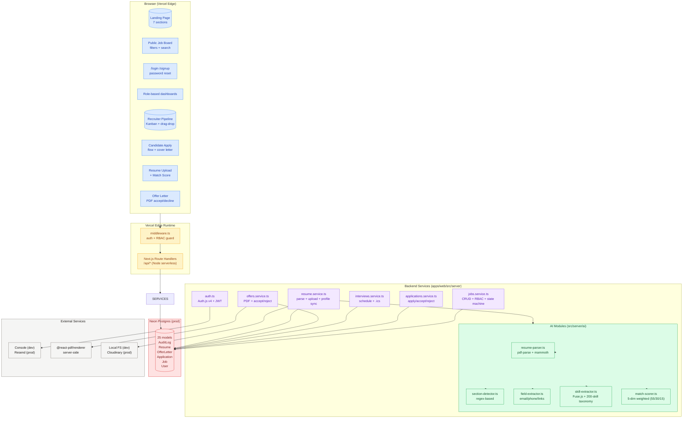

## Component responsibilities

| Layer               | Responsibility                                         | Tech                                                 |
| ------------------- | ------------------------------------------------------ | ---------------------------------------------------- |
| **Browser**         | All user-facing UI, drag-drop, real-time feedback      | Next.js 15 App Router, React 19, Tailwind, shadcn/ui |
| **Edge middleware** | Auth check, redirect unauthenticated from `/app/*`     | Next.js middleware + Auth.js callbacks               |
| **Route handlers**  | JSON API for `/api/*` (upload, stage move, send offer) | Next.js Route Handlers, Zod                          |
| **Services**        | Business logic, RBAC, state machine, transactions      | Prisma 5 + raw SQL helpers                           |
| **AI pipeline**     | Resume parsing, skill extraction, match scoring        | pdf-parse, mammoth, fuse.js, natural                 |
| **Data**            | Source of truth                                        | Neon Postgres (prod) / Docker (dev)                  |
| **External**        | Email, PDF rendering, file storage                     | Resend, @react-pdf/renderer, Cloudinary              |

## Data flow (apply → hire)

```
candidate uploads PDF
  → POST /api/me/resume
  → pdf-parse extracts text
  → section-detector → field-extractor → skill-extractor
  → candidate profile auto-populated
candidate browses /jobs
  → clicks a job
  → /jobs/[id] computes MatchCard in real-time
  → candidate clicks Apply
  → POST /api/jobs/[id]/apply
  → application row created (stage=APPLIED)
recruiter sees in pipeline
  → drag card to TECH_INTERVIEW
  → PATCH /api/recruiter/applications/[id]/stage
  → stage machine validates, audit log row, notification to candidate
recruiter schedules interview
  → POST /api/recruiter/interviews
  → ICS file generated, emailed to candidate + interviewers
recruiter sends offer
  → POST /api/recruiter/offers
  → @react-pdf renders branded PDF
  → PDF stored as data URL, application moves to OFFER stage
candidate accepts
  → POST /api/candidate/offers/[id]/accept
  → application → HIRED, offer → ACCEPTED
```
